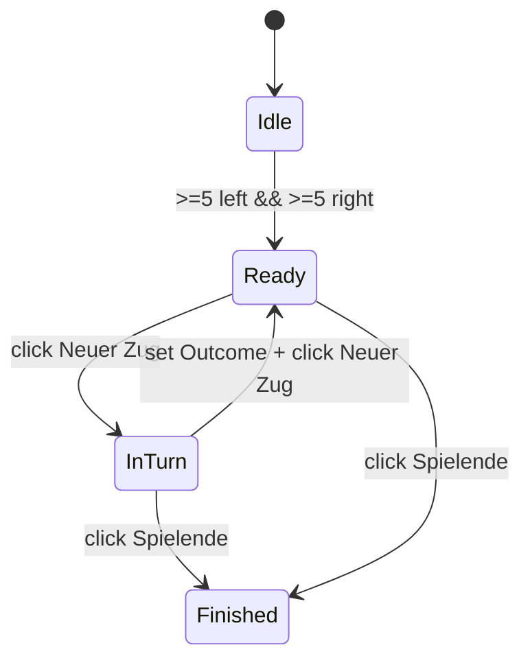

# Jugger Analytics — Recorder & Search (MVP)
*Stand: 2025-09-18 — Autor: Das Rind*

---

## 1) Ziel
**Spiele erfassen**, Züge als **JSON** speichern, erste **Suche/Stats**. Teilt Domain & UI‑Bausteine mit *Tactics* (Teams, Spieler, Feld).

---

## 2) Recording‑Flow
1. **Teams wählen/erstellen** (Header): Logo, Teamname, optional **Turnier**‑Feld.
2. **Spielerlisten** je Team (links/rechts). Spieler‑„Zellen“ per Toggle **aktiv**.
3. **Neuer Zug** → aktive 5+5 werden in die Mitte animiert (UI‑Effekt).
4. **Duell‑Ergebnis** wählen: *Team A gewinnt* | *Doppel* | *Team B gewinnt*.
5. **Neuer Zug** → Spieler zurück in Teamleisten.
6. **Spielende** → Winner/Abort setzen; Spiel speichern (IndexedDB) + JSON‑Export.

**Validierung**: Wenn ein Team <5 aktive Spieler → Hinweis „Warte auf Spieler/Team X unvollständig“ und *Neuer Zug* gesperrt.

---

## 3) Datenmodell
```ts
export type ID = string;
export type TeamSide = "left" | "right";
export type DuelOutcome = "leftWin" | "double" | "rightWin";

export interface TeamRef { id: ID; name: string; logoUrl?: string; color?: string; }
export interface PlayerRef { id: ID; teamId: ID; name: string; number?: string; role?: string; }

export interface LineupSlot { playerId: ID; position?: { x:number; y:number }; }
export interface Lineup { left: LineupSlot[]; right: LineupSlot[]; }

export interface Turn { id: ID; index: number; lineup: Lineup; outcome: DuelOutcome; notes?: string; ts: string; }

export interface GameMeta { tournament?: string; createdAt: string; createdBy?: string; version: string; }

export interface GameRecord {
  id: ID;
  left: TeamRef; right: TeamRef;
  players: PlayerRef[];
  turns: Turn[];
  winner?: TeamSide | "abort";
  aborted?: boolean;
  meta: GameMeta;
}
```

**Spieler‑Identität**: `teamId + playerId`; Name darf team‑intern doppeln (bei Erstellung Präfix/Nummer sichern).  
**Positions‑Optionalität**: Für spätere Heatmaps kompatibel zu *Tactics*‑Koordinaten.

---

## 4) UI‑Architektur (Angular)
```
apps/analytics/
  app/pages/record-game/   # Aufnahme UI
  app/pages/search/        # Suche & Stats
  app/components/*         # Header, PlayerList, TurnControls, WinnerSlider
  app/data/                # GameService (IndexedDB)
  app/state/               # record.store (Signals)
```

**Record‑Page Layout**
- Header: Turnier‑Textfeld, Team A/B, Winner‑Slider (für Finalstatus/Abbruch).
- Links/Rechts: Player‑Listen mit Aktiv‑Toggle (max 5 enforced).
- Mitte: Jugger‑Feld (UI‑Animation beim Turn‑Start).
- Footer: Controls (*Neuer Zug*, Outcome‑Buttons, *Spielende*, JSON‑Export).

---

## 5) Zustand & Guards

- `ready = activeLeft>=5 && activeRight>=5`
- Outcome Pflicht vor nächstem Turn.

---

## 6) Speicherung (ohne Fremd‑Lib)
- **IndexedDB** eigener, dünner Wrapper.  
- Store: `games` (key = `game.id`) + Indexe: `byLeft`, `byRight`, `byTournament`, `byPlayerKeys (multiEntry)`.
- **Autosave** nach jedem Turn; **JSON‑Export** als Backup.

---

## 7) Suche & Stats
- **Team Area**: Alle Spiele des Teams, aufklappbar → Turns/Outcomes.
- **Stats gegen [Team]**: Winrate, Top‑Aufstellungen (Top‑3), „gute Paare“ (häufig & erfolgreich).
- **Spieler‑Suche**: Team+Name/ID → alle Spiele/Turns des Spielers.
- **Turnier‑Suche**: `meta.tournament == Name`.

**Tierlist (Phase 1.5)**  
- Top‑5 Spieler nach Duell‑Winrate (min. N=10).  
- Top‑5 Teams nach Winrate (min. N Spiele).  
- Kennzeichnung kleiner Stichproben (⚠︎).

---

## 8) Akzeptanzkriterien (MVP)
- *Neuer Zug* nur bei 5+5 aktiv.
- Beim Start eines Turns werden die 10 Spieler sichtbar in die Mitte „gezogen“ (200–400 ms).
- Outcome muss gesetzt sein, bevor *Neuer Zug* erneut verfügbar ist.
- *Spielende* erzeugt vollständigen `GameRecord` und speichert lokal.
- JSON‑Export enthält alle Turns/Lineups/Outcomes.
- Suche liefert korrekte Treffer nach Team/Spieler/Turnier.

---

## 9) Risiken & Gegenmaßnahmen
- **Namen kollidieren** → Identität über IDs; UI schlägt Präfix/Nummer vor.
- **Kleine Stichproben** → Hinweise/Filter (min N).
- **Datenverlust** → Autosave + Exporthinweis nach Spielende.
